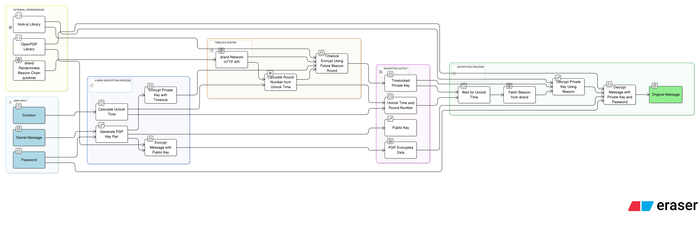

# Hybrid Time-Lock Encryption (HTLE)

A dual-factor cryptographic framework combining password-based encryption with decentralized time-lock cryptography using drand randomness beacons.

This implementation accompanies the research paper: **"Hybrid Time-Lock Encryption: A Dual-Factor Cryptographic Framework for Temporal Access Control"**

## How It Works



The system provides **dual-factor temporal access control**:

1. **Factor 1 (Knowledge)**: Password-protected OpenPGP private key
2. **Factor 2 (Time)**: drand beacon-based time-lock encryption

### Encryption Flow

1. Generate PGP key pair
2. Encrypt data with public key
3. Protect private key with user password
4. Time-lock the password-protected key using drand round number

### Decryption Flow

1. **Gate 1**: Wait for drand beacon to release round signature
2. **Gate 2**: Provide correct password to unlock private key
3. Decrypt data with recovered private key

**Key Security Property**: An attacker with the password cannot decrypt before the time-lock expires. An attacker who waits for the time-lock cannot decrypt without the password.

## Setup

### Install Dependencies

```bash
pnpm install
```

### Environment Variables

Create a `.env` file with drand network configuration:

```bash
# drand quicknet configuration
DRAND_CHAIN_URL=https://api.drand.sh/52db9ba70e0cc0f6eaf7803dd07447a1f5477735fd3f661792ba94600c84e971
DRAND_CHAIN_HASH=52db9ba70e0cc0f6eaf7803dd07447a1f5477735fd3f661792ba94600c84e971
DRAND_PUBLIC_KEY=83cf0f2896adee7eb8b5f01fcad3912212c437e0073e911fb90022d3e760183c8c4b450b6a0a6c3ac6a5776a2d1064510d1fec758c921cc22b0e17e63aaf4bcb5ed66304de9cf809bd274ca73bab4af5a6e9c76a4bc09e76eae8991ef5ece45a
```

For other networks, visit the [drand networks page](https://docs.drand.love/dev-guide/developer/http-api).

## Usage

### Basic Example

```typescript
import { hybridEncrypt, hybridDecrypt } from './encryption/hybrid';

// Encrypt with 1-minute time-lock
const encrypted = await hybridEncrypt('secret message', {
  password: 'my-secure-password',
  duration: 'min'  // or 'month', 'year'
});

// Wait for time-lock to expire...
// Then decrypt
const decrypted = await hybridDecrypt(encrypted, 'my-secure-password');
```

### Custom Duration

```typescript
const encrypted = await hybridEncrypt('secret message', {
  password: 'my-secure-password',
  durationMs: 30000  // 30 seconds
});
```

### Run Demo

```bash
pnpm run dev
```

## Testing

The test suite validates security properties and performance of the HTLE framework.

### Run All Tests

```bash
pnpm test
```

### Test Suites

| Command | Description |
|---------|-------------|
| `pnpm test:security` | Security validation tests (TC1-TC5) |
| `pnpm test:functional` | Functional correctness tests |
| `pnpm test:benchmark` | Performance benchmarks |
| `pnpm test:coverage` | Test coverage report |

### Security Test Cases

| Test | Description | Validates |
|------|-------------|-----------|
| TC1 | Premature decryption attempt | Time-lock integrity |
| TC2 | Wrong password after unlock | Password factor security |
| TC3 | Wrong round signature | Round-specific binding |
| TC5 | Coercion resistance | Dual-factor independence |

### Benchmark Results

| Payload Size | Ciphertext | Overhead | Encrypt | Decrypt |
|--------------|------------|----------|---------|---------|
| 100 bytes | 635 bytes | 63.50x | ~1600ms | ~1400ms |
| 1 KB | 1.9 KB | 7.43x | ~100ms | ~1500ms |
| 10 KB | 14 KB | 1.96x | ~85ms | ~1420ms |
| 100 KB | 139 KB | 1.42x | ~80ms | ~1550ms |

*Note: First encryption includes RSA 2048-bit key generation (~1500ms). Decryption time includes drand beacon fetch.*

**Time-Lock Precision**: ~1.5 second deviation from target unlock time (within drand beacon period).

## Project Structure

```
src/
├── encryption/
│   ├── hybrid.ts          # Main encrypt/decrypt API
│   ├── pgp.ts             # OpenPGP key management
│   ├── timelock.ts        # drand time-lock integration
│   ├── security.test.ts   # Security test suite
│   ├── functional.test.ts # Functional test suite
│   └── benchmark.test.ts  # Performance benchmarks
├── types.ts               # TypeScript interfaces
├── env.ts                 # Environment configuration
├── test-utils.ts          # Shared test utilities
└── index.ts               # Demo application
```

## Dependencies

- **openpgp**: RFC 4880 compliant PGP encryption
- **tlock-js**: drand time-lock encryption library
- **zod**: Runtime type validation
- **vitest**: Test framework

## Limitations

1. **Liveness Assumption**: Requires drand network to remain operational
2. **Quantum Vulnerability**: BLS signatures and RSA/ECC are not quantum-resistant

## References

- [drand Documentation](https://docs.drand.love/)
- [OpenPGP RFC 4880](https://www.rfc-editor.org/rfc/rfc4880)
- [tlock-js Library](https://github.com/drand/tlock-js)

## License

ISC
